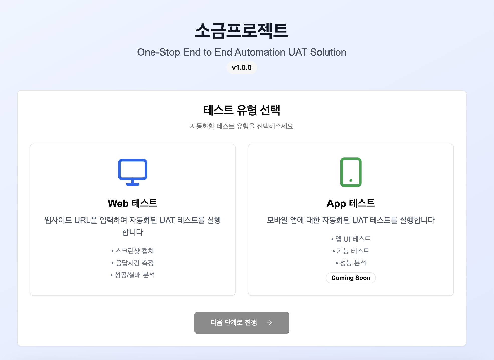
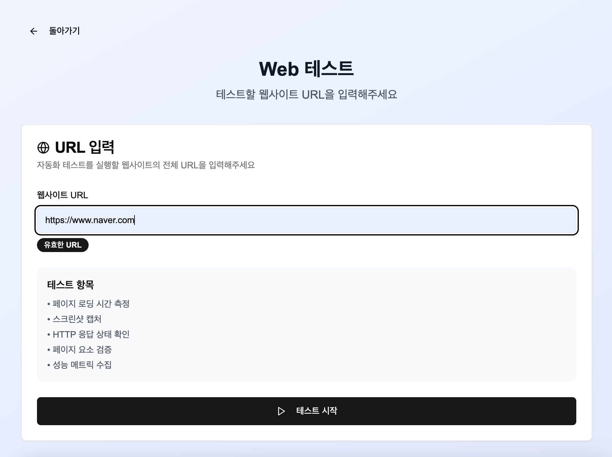
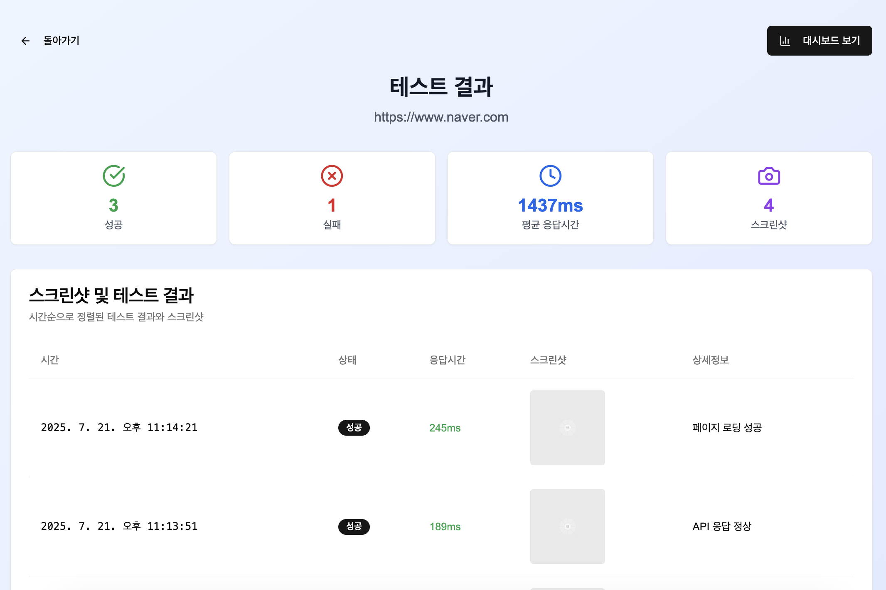
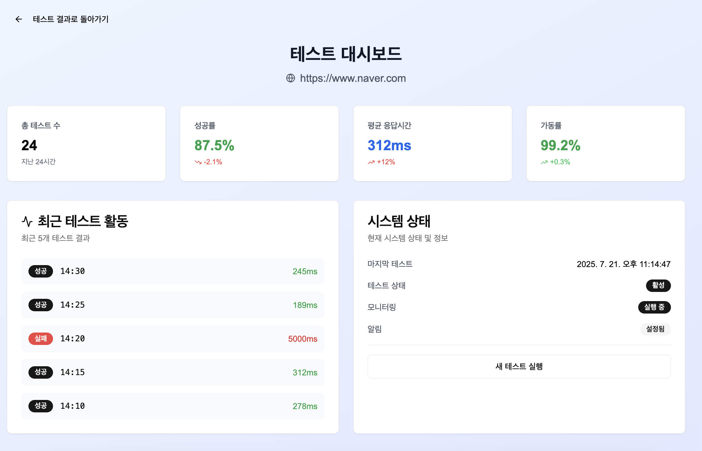
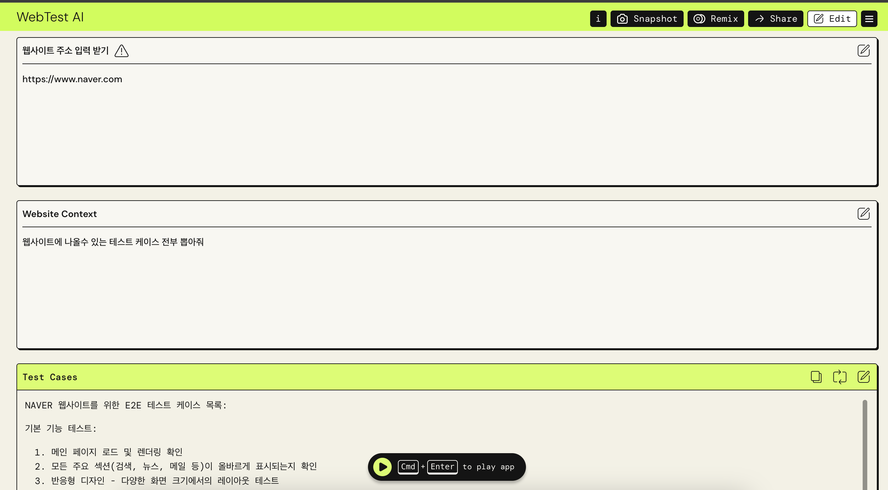
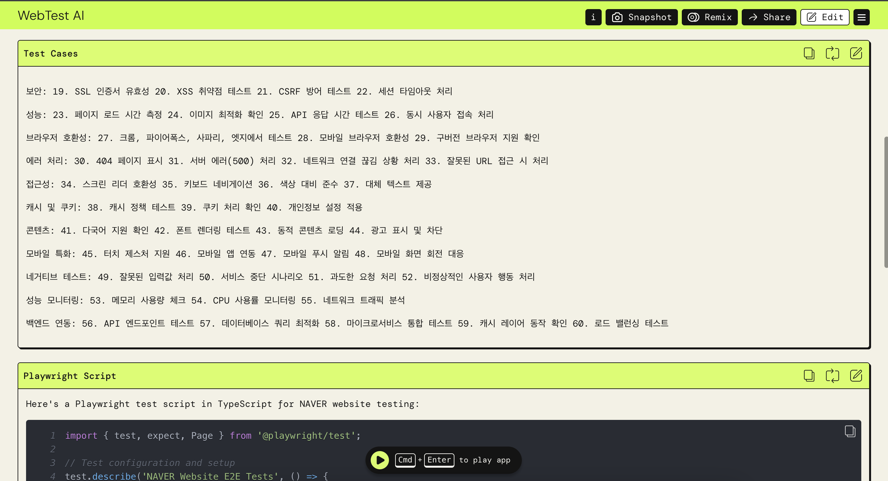
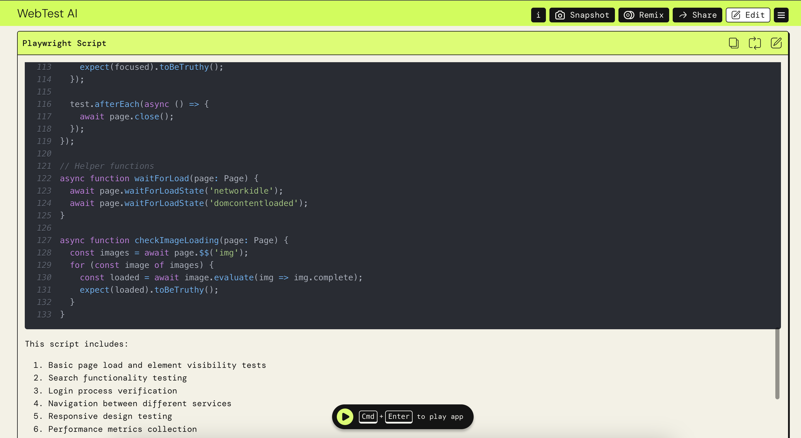

# SOGM Project

## 📄 기술명: One-Stop End to End Automation UAT Solution (OSEAUS)

---

## 플랫폼 구성

---

## 주요 기능

### 1. 웹 페이지 및 앱 시각 정보 수집 모듈

* 지정된 URL 및 하위 링크를 재귀적으로 탐색하며 전체 UI 스크린샷을 캡처
* 이미지 + DOM 구조와 URL 흐름을 활용해 화면 별 메타데이터 수집

  * 수집 정보 예시: 컴포넌트 이름, 버튼/입력 필드 위치 등

---

### 2. 멀티모달 LLM 기반 테스트 시나리오 생성 모듈

* Vision-Text 기반 LLM을 활용해 UI 흐름 및 사용자 행위 예측
* 시각적 요소를 기반으로 사용자 액션(클릭, 입력, 탐색 등)을 자동 추론
* Playwright, Appium 기반의 테스트 스크립트 자동 생성

---

### 3. 코드/이미지 기반 변화 감지 및 차등 테스트 모듈

* 변경 전/후 코드 diff 및 스크린샷 유사도 비교

  * (기법 예: Perceptual Hashing, CLIP 등 활용)
* 변경 영향도 분석 후, 관련된 페이지만 선택적으로 테스트 수행

---

### 4. 테스트 실행 및 리포트 생성 모듈

* 생성된 테스트 시나리오를 실행
* 실행 결과를 자동 수집 및 요약 리포팅

---

## 데모 사이트 (Mock)

테스트 흐름:
**웹테스트 선택 → URL 입력 → 테스트 진행 결과 → 대시보드 리포팅 확인**

* 데모 URL:
  [https://v0-one-stop-automation-solution.vercel.app/](https://v0-one-stop-automation-solution.vercel.app/)

* UI 미리보기
  
  
  
  

---

## PoC 사이트

테스트 흐름:
**URL 입력 → 프롬프트 추가 → LLM 처리 → 테스트 케이스 + Playwright Test 스크립트 생성**

* PoC URL:
  [https://partyrock.aws/u/byc3230/\_M2fzRJ5l/WebTest-AI](https://partyrock.aws/u/byc3230/_M2fzRJ5l/WebTest-AI)

* UI 미리보기
  
  
  

* 결과 Snapshot:
  [https://partyrock.aws/u/byc3230/\_M2fzRJ5l/WebTest-AI/snapshot/s9vuAzqo1](https://partyrock.aws/u/byc3230/_M2fzRJ5l/WebTest-AI/snapshot/s9vuAzqo1)

---

## 연구 진행 시나리오

### 시나리오 1: **UAT Full Test Case** (시스템 오픈 전)

**절차:**

1. URL 입력
2. 초기 페이지 정보 수집
3. 전체 스크립트 생성
4. 화면 이미지 생성
5. 멀티모달 LLM 처리
6. Web → Playwright, App → Appium 스크립트 자동 생성
7. 테스트 실행
8. 결과 리포트 도출

---

### 시나리오 2: **SR (Service Request) Test Case**

**(변경된 웹페이지 및 연관된 페이지만 테스트)**

**절차:**

1. 변경 전/후 이미지 및 코드 입력
2. 멀티모달 LLM 처리
3. Web → Playwright, App → Appium 스크립트 자동 생성
4. 테스트 실행
5. 결과 리포트 도출
