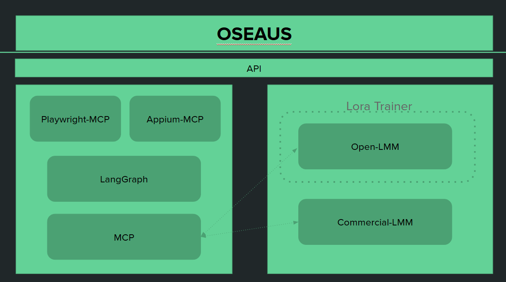

# SOGM
SOGM Project

[구현제안서]

One-Stop End to End Automation UAT Solution

[플랫폼 구성]

[Mock 사이트 URL]

https://v0-one-stop-automation-solution.vercel.app/

[PoC  URL]

https://partyrock.aws/u/byc3230/_M2fzRJ5l/WebTest-AI?

결과 SnapShot

https://partyrock.aws/u/byc3230/_M2fzRJ5l/WebTest-AI/snapshot/s9vuAzqo1

[PoC] 

시나리오 1 - UAT Full Test Case  (시스템 오픈전)

- URL -> 정보 받고 -> 스크립트 실행 -> 화면 이미지 -> chatgpt 넣고 -> 웹 경우 playwright 스크립트 생성, App 일 경우 appium 스크립트 생성 -> 실행-> 결과 리포트 도출

시나리오 2 - SR (Service Request) Test Case (변경된 웹페이지 및 연관된 페이지만 테스트 진행하는 case)

- 이미지 (변경 전, 변경 후)와 코드(변경 전, 변경 후)를 입력받아 -> chatgpt 넣고 -> 웹 경우 playwright 스크립트 생성, App 일 경우 appium 스크립트 생성 -> 실행-> 결과 리포트 도출
